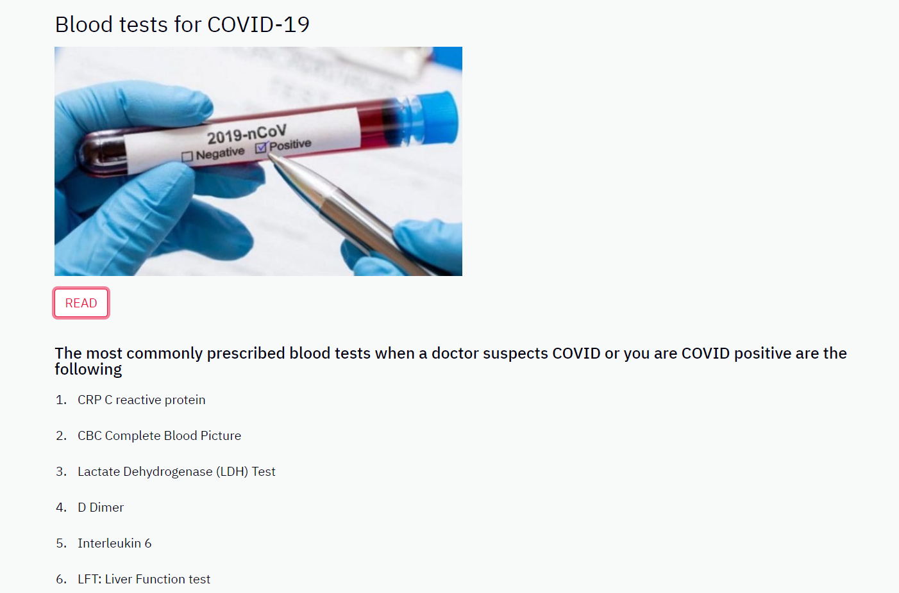
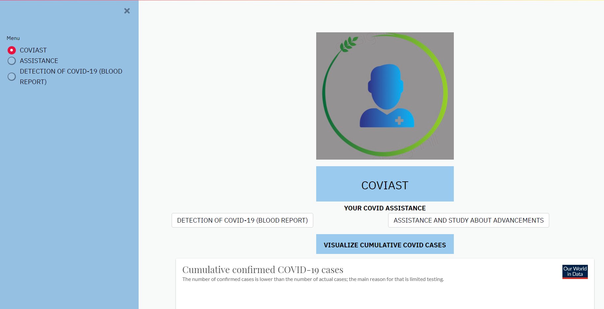
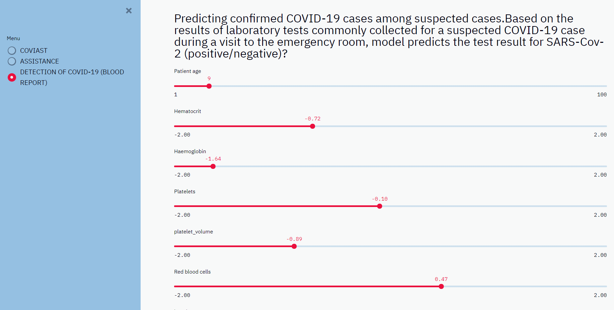
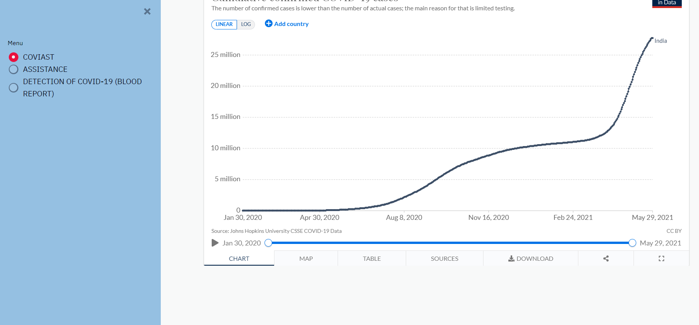
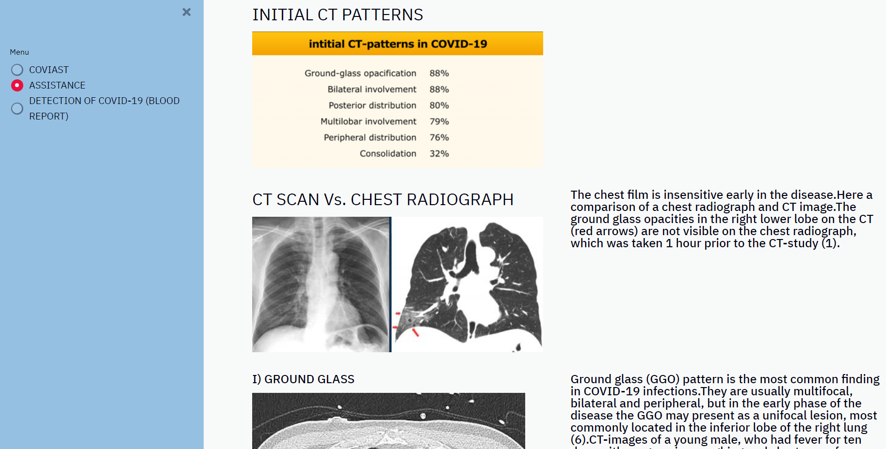
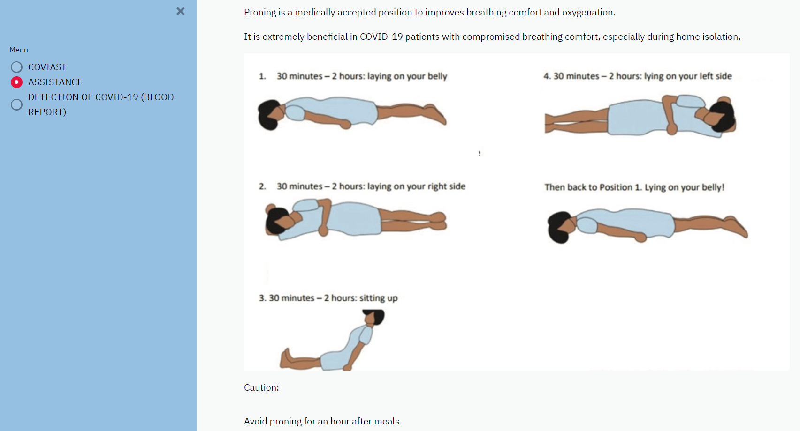

# COVIAST
## YOUR COVID ASSISTANCE
### By team - DATA UNRAVEL

## Table of contents
* [Information](#project-information)
* [Screenshots](#screenshots)
* [Technologies](#technologies)
* [Features](#features)
* [Status](#status)
* [Contact](#contact) 

## PROJECT INFORMATION 
The impact of the 2020 coronavirus pandemic has been largely disruptive.
In India, more than 332,000 Covid-19 infections were reported today, along with approximately 2,250 deaths.
During this tough situation , We help to reduce the emotional stress baggage and uncertainties of the deadly virus.

**OBJECTIVE : COVIAST is a platform to assist the public with their blood sample report in hand and predict the virus attack along with informative home remedial measures to combat the deadly virus. 
Given the large number of literature and the rapid spread of COVID-19, it is hard for us to keep up with new information on the virus , thus providing users a one stop solution through frequent updations.**

## Screenshots

 

  
  

 

</p

## Features

* COVIAST - HOME PAGE
* ASSISTANCE
* DETECTION OF COVID-19 (BLOOD REPORT) 

## Status
Project done 

## Contact
Created by [Chiranthana R R](https://www.linkedin.com/in/chiranthana-r-r-232385200/) - feel free to contact me!

Created by [Timsal Zehra](https://www.linkedin.com/in/timsal-zehra-43863b1a6) - feel free to contact me!

Created by [Aditi Rastogi](https://www.linkedin.com/in/aditi-rastogi-961789191) - feel free to contact me!

